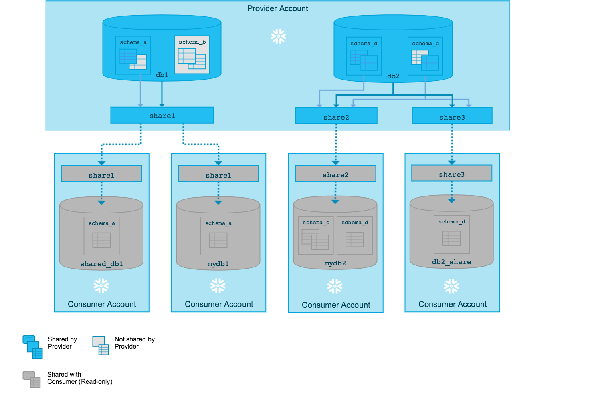
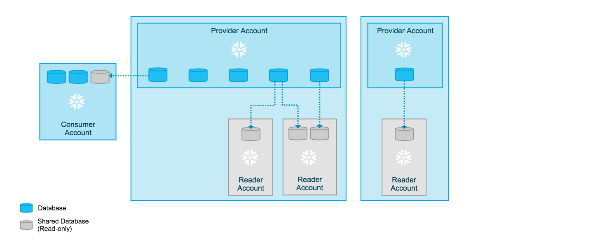

# Phase 7: Data Sharing

This phase enables secure, scalable sharing of de-identified clinical data with up to 1000 different hospitals using Snowflake Secure Data Sharing.
Snowflake Secure Data Sharing is a powerful feature that enables live, governed, and cost-effective data sharing between accounts without copying or moving data

## Key Steps
- Create a secure share for the Gold table.
- Grant SELECT access to the share.
- Add up to 1000 hospital accounts as **consumers.**
- Ensure only de-identified, compliant data is shared.

## Usage
1. Edit `phase7_data_sharing_setup.sql` to include the list of hospital accounts.
2. Run the script in your Snowflake environment.
3. Each hospital will receive access to the shared data via their Snowflake account.

## Notes
- Use automation (Python, Terraform, etc.) to generate and manage large account lists.
- Ensure compliance and auditability for all shared data.

Note:
# How does Secure Data Sharing work?
With Secure Data Sharing, no actual data is copied or transferred between accounts. All sharing uses **Snowflake’s services layer and metadata store.** Shared data does not take up any storage in a consumer account and therefore does not contribute to the consumer’s monthly data storage charges. The only charges to consumers are for the compute resources (i.e. virtual warehouses) used to query the imported data.

****Data providers add Snowflake objects** (databases, schemas, tables, secure views, etc.) to a share using either or both of the following options:

**Option 1:** Grant privileges on objects to a share via a database role.
**Option 2:** Grant privileges on objects directly to a share.
You choose which accounts can consume data from the share by adding the accounts to the share.

**Snowflake accounts**
Data sharing is **only supported between Snowflake accounts**. As a data provider, you might want to share data with a consumer who does not already have a Snowflake account or is not ready to become a licensed Snowflake customer.

**No Snowflake accounts**
**Reader Account: Third Party**
To facilitate sharing data with these consumers, you can create reader accounts. Reader accounts (formerly known as “read-only accounts”) provide a quick, easy, and cost-effective way to share data without requiring the consumer to become a Snowflake customer.

Each reader account belongs to the provider account that created it. As a provider, you use shares to share databases with reader accounts; however, a reader account can only consume data from the provider account that created it. Refer to the following diagram:
